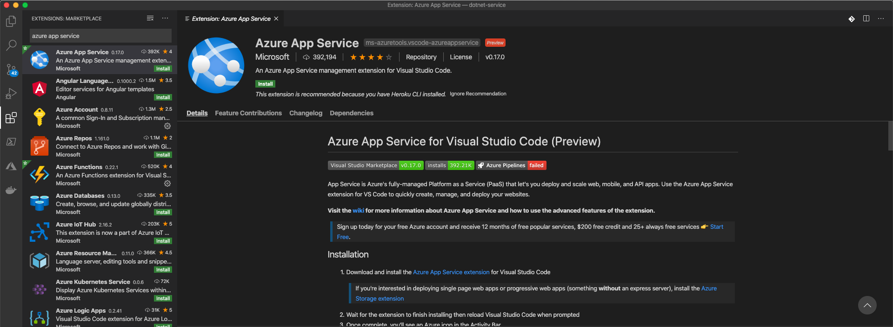

Resource: https://docs.microsoft.com/en-us/aspnet/core/tutorials/grpc/grpc-start?view=aspnetcore-3.1&tabs=visual-studio-code


Create new project 

```bash
cd dotnet-service
dotnet new grpc
dotnet dev-certs https --trust

dotnet run
```


issues on macos : https://docs.microsoft.com/en-us/aspnet/core/grpc/troubleshoot?view=aspnetcore-3.1#unable-to-start-aspnet-core-grpc-app-on-macos

- Configure Kestrel to not use TLS for on server side
- For the client also we will need to disable TLS.

```
The gRPC template is configured to use Transport Layer Security (TLS). gRPC clients need to use HTTPS to call the server.

macOS doesn't support ASP.NET Core gRPC with TLS. Additional configuration is required to successfully run gRPC services on macOS. For more information, see Unable to start ASP.NET Core gRPC app on macOS.
```

- Change the `Program.cs` as

  ```
  Host.CreateDefaultBuilder(args)
          .ConfigureWebHostDefaults(webBuilder =>
          {
              webBuilder.ConfigureKestrel(options =>
              {
                  // Setup a HTTP/2 endpoint without TLS.
                  options.ListenLocalhost(5000, o => o.Protocols = 
                      HttpProtocols.Http2);
              });
              webBuilder.UseStartup<Startup>();
          });
  ```

  

- now restart the project using `dotnet run`


### Testing gRPC service 

- launch app [BoolRPC](https://github.com/uw-labs/bloomrpc)

- import the .proto folder from the project

- play the Greeter request : 

  


### Creating a client with .NET

- Create a console app with .NET

  ```bash
  # Create project
  mkdir dotnet-client
  cd dotnet-client
  dotnet new console
  
  # Add required Nugets
  dotnet add dotnet-client.csproj package Grpc.Net.Client
  dotnet add dotnet-client.csproj package Google.Protobuf
  dotnet add dotnet-client.csproj package Grpc.Tools
  ```
	This updates the projects csproj file as : 
  ```diff
  +  <ItemGroup>
  +    <PackageReference Include="Google.Protobuf" Version="3.12.3" />
  +    <PackageReference Include="Grpc.Net.Client" Version="2.29.0" />
  +    <PackageReference Include="Grpc.Tools" Version="2.30.0">
  +      <IncludeAssets>runtime; build; native; contentfiles; analyzers; buildtransitive</IncludeAssets>
  +      <PrivateAssets>all</PrivateAssets>
  +    </PackageReference>
  +  </ItemGroup>
  +
  ```

  

- Add proto files for cleint

  ```
  cp -r ../dotnet-service/Protos ./
  ```

  Update the csproj file to include proto in project : 

  ```diff
  + <ItemGroup>
  +   <Protobuf Include="Protos\greet.proto" GrpcServices="Client" />
  + </ItemGroup>
  ```

- Create a Greeter client

- Add the options for namespace in the proto file : 

  ```protobuf
  syntax = "proto3";
  
  ```

// This is the namespace for which client will be generated
  option csharp_namespace = "GrpcGreeter";

  package greet;

  // The greeting service definition.
  service Greeter {
    // Sends a greeting
    rpc SayHello (HelloRequest) returns (HelloReply);
  }

  // The request message containing the user's name.
  message HelloRequest {
    string name = 1;
  }

  // The response message containing the greetings.
  message HelloReply {
    string message = 1;
  }

  ```
  
  
  
- Run command `dotnet run build`, which will create the Greeter implementation using protofile in namespace `GrpcGreeter` as defined above.

- Now use this generated namespace in the Program.cs to make a call : 

  ```c#
  using System;
  using System.Net.Http;
  using System.Threading.Tasks;
  using GrpcGreeter;
  using Grpc.Net.Client;
  
  namespace GrpcGreeterClient
  {
    class Program
    {
      static async Task Main(string[] args)
      {
        using var channel = GrpcChannel.ForAddress("http://localhost:5000");
        var client =  new Greeter.GreeterClient(channel);
        var reply = await client.SayHelloAsync(
                new HelloRequest { Name = "GreeterClient" });
        Console.WriteLine("Greeting: " + reply.Message);
        Console.WriteLine("Press any key to exit...");
        Console.ReadKey();
      }
    }
  }
  ```

  

- Expect following error on dotnet run 

  ```yml
  Unhandled exception. Grpc.Core.RpcException: Status(StatusCode=Internal, Detail="Error starting gRPC call. HttpRequestException: An error occurred while sending the request. IOException: The response ended prematurely.")
     at GrpcGreeterClient.Program.Main(String[] args) in /Users/dawn/Documents/projects/grpc-stub/dotnet-client/Program.cs:line 18
     at GrpcGreeterClient.Program.<Main>(String[] args)
  ```

  This error occurs because our server is using HTTP2 without 

  To fix this, Enable the HTTP2 without SSL for the server : 

  ```c#
  AppContext.SetSwitch("System.Net.Http.SocketsHttpHandler.Http2UnencryptedSupport", true);
  ```

  

- now run command : `dotnet run `

  ```
  
  ```

  


### Deploy server on Azure App Service

- resource: https://docs.microsoft.com/en-us/aspnet/core/tutorials/publish-to-azure-webapp-using-vscode?view=aspnetcore-3.1

- Install the app service extension for vscode : 

  

- Create a release package to a folder called release: 

  ```bash
  dotnet publish -c Release -o ./publish
  
  ```

  

- now click on the publish folder and choose `Deploy to web app`

  

- naem : `grpc-server`

- notice on bottom right the notifications showign progress of the webapp creation.

- the app service does not support gRPC ` `:  https://github.com/dotnet/aspnetcore/issues/9020

  ```
  The HTTP/2 implementation of Http.Sys does not support HTTP response trailing headers which gRPC relies on.
  ```

  

  

  ###  Run server on AKS 

  - Dockerize our app : 
  
    ```dockerfile
    # Stage 1: Build project into
    FROM mcr.microsoft.com/dotnet/core/sdk:3.1 AS build
    WORKDIR /source
    
    COPY *.csproj .
    RUN dotnet restore
    
    COPY . .
    RUN dotnet build
    RUN dotnet publish -c release -o /app --no-restore
    
    # Stage 2: run project
    FROM mcr.microsoft.com/dotnet/core/aspnet:3.1
    WORKDIR /app
    EXPOSE 80
    
    COPY --from=build /app .
    ENTRYPOINT ["dotnet", "dotnet-service.dll"]
    ```
  
    
  
  - build and test docker image : 
  
    ```
    docker build -t grpc-server . && dodcker run -p 5000:80 grpc-server
    ```
  
    